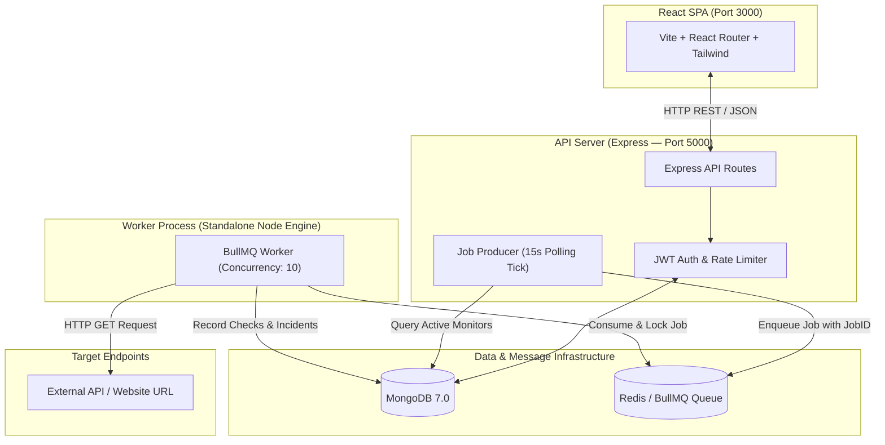

# UpBro

UpBro is an open-source API and website health monitoring system built on the MERN stack with a queue-based background monitoring engine. You register HTTP endpoints, configure check intervals and expected status codes, and UpBro automatically pings targets in the background. It records round-trip latency, computes rolling 24-hour uptime metrics, detects outages, logs ongoing and resolved incidents, and displays real-time health data on an engineering instrument dashboard.

---

## Architecture at a Glance

The application is split into two independent concerns: **Serving the Web Application / API** and **Executing Background Health Checks**.



---

## Tech Stack

| Layer | Technology | Reason |
| :--- | :--- | :--- |
| **Frontend** | React 18, Vite, Tailwind CSS | Fast SPA rendering, component modularity, and zero-runtime CSS utility engine. |
| **HTTP Client** | Axios | Interceptor support for automatic JWT Bearer header injection and timeout control. |
| **Backend API** | Node.js, Express | Non-blocking I/O event loop for handling API requests and rate-limiting middleware. |
| **Database** | MongoDB, Mongoose 8 | Document store for JSON-like monitor configurations, check logs, and time-stamped incidents. |
| **Message Queue** | Redis 7, BullMQ 6 | In-memory atomic queue providing distributed job reservation, concurrency locks, and retries. |
| **Testing** | Jest, Supertest | Unit and integration testing for Express routes, auth flow, and multi-tenant scoping. |
| **Logging** | Pino, pino-http | Structured JSON logger output with `X-Request-ID` correlation tokens across HTTP requests. |
| **Containerization** | Docker, Nginx, Docker Compose | Multi-container orchestration powering production API, worker, database, and SPA static server. |

---

## How a Check Works

Here is how one complete monitoring cycle flows through the system:

1. **Producer Tick:** Every 15 seconds, the job producer in the API server queries MongoDB for active monitors whose elapsed time since `lastCheckedAt` meets or exceeds their configured `interval`.
2. **Deduplicated Enqueue:** For each due monitor, the producer calculates a deterministic job ID (`ping-MONITORID-TIMEBUCKET`) and enqueues a check job to the Redis BullMQ queue (`ping-checks-queue`). If a job for that monitor in the current interval window is already queued, Redis silently rejects the duplicate.
3. **Worker Pickup:** A standalone worker process claims the job using Redis atomic locks, respecting a `concurrency` setting of 10 parallel HTTP checks.
4. **HTTP Execution:** The worker issues an HTTP `GET` request to the target URL using Axios, enforcing the monitor's `timeout` limit.
5. **Success / Failure Evaluation:** If a response arrives within the timeout and matches `expectedStatus` (e.g., 200), the check succeeds. If a status mismatch, network error (`ECONNREFUSED`), or timeout occurs, the check fails with a descriptive error string.
6. **Data Persistence & Incident Tracking:**
   - A `Check` document is saved in MongoDB recording status code, response time, and timestamp.
   - If the check fails **2 consecutive times**, the worker creates a new `Incident` document (`status: "ongoing"`).
   - When the check succeeds again, any active `Incident` is marked `status: "resolved"`, its duration is calculated, and a recovery notification is logged.

---

## Getting Started

### Option A: One-Command Stack via Docker Compose (Recommended)

**Prerequisites:** Docker & Docker Compose installed.

```bash
# Clone the repository
git clone https://github.com/callmekriztal/UpBro.git
cd UpBro

# Build and start all 5 containers (API, Worker, Client, MongoDB, Redis)
docker-compose up --build
```
Access the application:
- **Client Dashboard:** `http://localhost:3000`
- **API Server:** `http://localhost:5000`
- **Health Check:** `http://localhost:5000/health`
- **Metrics JSON:** `http://localhost:5000/metrics`

---

### Option B: Local Manual Setup

**Prerequisites:**
- Node.js v18+ and npm
- MongoDB instance running on `localhost:27017`
- Redis instance running on `localhost:6379`

#### 1. Environment Variables Configuration

Create `server/.env`:
```env
PORT=5000
MONGO_URI=mongodb://localhost:27017/uptime_monitor
REDIS_HOST=localhost
REDIS_PORT=6379
JWT_SECRET=super_secret_jwt_key_change_in_production
WORKER_CONCURRENCY=10
```

#### 2. Install & Start Services

**Terminal 1 — Database Services:**
```bash
# Ensure local MongoDB and Redis are active
mongod --dbpath ./data --fork --logpath ./mongodb.log
redis-server --daemonize yes
```

**Terminal 2 — Backend API Server & Standalone Worker Process:**
```bash
cd server
npm install
npm run dev
```

**Terminal 3 — React Frontend:**
```bash
cd client
npm install
npm run dev
```

---

## Project Structure

```
UpBro/
├── .github/
│   └── workflows/
│       └── ci.yml                 # GitHub Actions test & build pipeline
├── client/                        # React Vite Single Page Application
│   ├── src/
│   │   ├── api/                   # Axios client with JWT request/response interceptors
│   │   ├── components/            # Instrument panel components (Navbar, Modal, Sparkline, Timeline)
│   │   ├── context/               # AuthContext managing user session and localStorage
│   │   ├── pages/                 # Dashboard, Monitor Detail, Login, and Register screens
│   │   └── index.css              # Design tokens (#0E1116, #161B22, #262C36, #E8A33D)
│   ├── Dockerfile                 # Multi-stage production Nginx static container build
│   └── nginx.conf                 # SPA fallback routing Nginx configuration
├── server/                        # Backend API Server & Queue Engine
│   ├── __tests__/                 # Jest + Supertest integration test suite
│   ├── src/
│   │   ├── config/                # Database connection, Redis options, and Pino logger
│   │   ├── controllers/           # Auth, Monitor CRUD, Check, Incident, Health/Metrics logic
│   │   ├── middleware/            # Auth JWT, rate limiters, error handling, request ID tracing
│   │   ├── models/                # Mongoose schemas (User, Monitor, Check, Incident)
│   │   ├── queue/                 # BullMQ Queue instance & Producer deduplication service
│   │   ├── routes/                # Express API routes
│   │   ├── services/              # Worker HTTP execution & NotificationService abstraction
│   │   └── worker.js              # Standalone Worker process entry point
│   ├── Dockerfile                 # Node.js production server Dockerfile
│   └── server.js                  # Express API Server entry point & producer boot
└── docker-compose.yml             # Orchestration wiring API, Worker, Client, MongoDB, and Redis
```

---

## API Reference

### Auth (`/api/auth`)

| Method | Path | Auth Required | Description |
| :--- | :--- | :--- | :--- |
| `POST` | `/api/auth/register` | No | Creates a new user account (returns JWT token). |
| `POST` | `/api/auth/login` | No | Authenticates email/password (returns JWT token). |
| `POST` | `/api/auth/logout` | Yes | Clears active client session. |

### Monitors (`/api/monitors`)

| Method | Path | Auth Required | Description |
| :--- | :--- | :--- | :--- |
| `GET` | `/api/monitors` | Yes | Lists all monitors owned by authenticated user with latest check stats. |
| `POST` | `/api/monitors` | Yes | Creates a new monitor configuration (URL, interval, timeout, expected status). |
| `GET` | `/api/monitors/:id` | Yes | Fetches single monitor configuration by ID. |
| `PATCH` | `/api/monitors/:id` | Yes | Updates monitor settings (URL, interval, timeout, expected status). |
| `DELETE` | `/api/monitors/:id` | Yes | Deletes monitor and associated check/incident records. |
| `POST` | `/api/monitors/:id/pause` | Yes | Pauses automated background checks (`isActive: false`). |
| `POST` | `/api/monitors/:id/resume` | Yes | Resumes automated background checks (`isActive: true`). |

### Stats, Incidents & Checks (`/api/monitors/:id/*`)

| Method | Path | Auth Required | Description |
| :--- | :--- | :--- | :--- |
| `GET` | `/api/monitors/:id/stats` | Yes | Returns aggregated 24h metrics (uptime %, avg response time, total checks). |
| `GET` | `/api/monitors/:id/incidents` | Yes | Fetches historical incidents (ongoing and resolved outage logs). |
| `GET` | `/api/monitors/:id/checks` | Yes | Fetches raw historical check logs sorted by timestamp. |

### Observability & System (`/`)

| Method | Path | Auth Required | Description |
| :--- | :--- | :--- | :--- |
| `GET` | `/health` | No | Liveness probe returning HTTP 200/503 for MongoDB and Redis status. |
| `GET` | `/metrics` | No | System counters JSON payload (total monitors, active count, 24h checks, queue depth). |

---

## Notable Design Decisions

- **Queue Process Separation:** Health checks are executed by a dedicated worker process (`src/worker.js`) rather than inside the Express API server. This keeps web requests responsive regardless of background check load.
- **Idempotent Job Enqueueing:** Producer job IDs are deterministically hashed (`ping-MONITORID-TIMEBUCKET`). Redis ignores duplicate `queue.add()` calls within the same interval window, preventing duplicate checks during server restarts or overlapping producer ticks.
- **Flapping Mitigation:** Incidents require **2 consecutive failed checks** before opening an outage record. This prevents false alarms and alert fatigue caused by momentary network blips.
- **Transient vs. Domain Error Classification:** If a target site returns HTTP 500 or connection refused, it is recorded as a valid failed `Check` document without retrying. If a local worker infrastructure glitch occurs (e.g. local DNS timeout), BullMQ executes **exponential backoff retries** (3 attempts).
- **Decoupled Notification Architecture:** Alert and recovery notifications pass through a `NotificationService` abstraction. Incident detection logic dispatches events without coupling directly to specific email vendors.
- **Graceful Shutdown:** The worker listens to `SIGTERM` and `SIGINT`, executing `worker.close()` to let in-flight HTTP requests complete cleanly before terminating process execution.

---

## Known Limitations

- **Single Redis Instance:** Uses a single Redis host without Sentinel or Redis Cluster failover.
- **Local Dev Notifications:** The `NotificationService` formats and logs alerts to stdout console. Connecting real email providers (SendGrid/Resend) or Slack webhooks requires configuring production API keys.
- **Producer Polling Jitter:** The job producer runs on an in-memory 15-second `setInterval` loop. Depending on when the tick fires relative to clock time, a 1-minute interval monitor will execute checks every ~60 to 75 seconds rather than exact millisecond precision.
- **Single Worker Default:** Tested primarily with a single worker node instance (`concurrency: 10`). Large-scale deployment with multiple distributed worker hosts across regions remains un-tested in this repository.

---

## Running Integration Tests

The project includes an integration test suite powered by **Jest** and **Supertest** covering authentication, CRUD, and multi-tenant security scoping:

```bash
cd server
npm test
```
