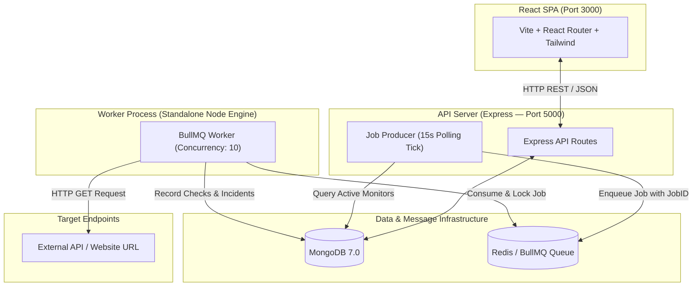

# UpBro

UpBro is an open-source API and website health monitoring system built on the MERN stack with a queue-based monitoring engine. You register HTTP endpoints, configure check intervals and expected status codes, and UpBro automatically pings targets in the background. It records round-trip latency, computes rolling 24-hour uptime metrics, detects outages, logs ongoing and resolved incidents, and displays real-time health data on an engineering instrument dashboard.

---

## Architecture at a Glance

The system is split into two independent concerns: **Serving the Web Application / API** and **Executing Background Health Checks**.



---

## Tech Stack

| Layer | Technology | Reason |
| :--- | :--- | :--- |
| **Frontend** | React 18, Vite, Tailwind CSS | Fast SPA rendering, component modularity, and zero-runtime CSS utilities. |
| **HTTP Client** | Axios | Interceptors for automatic JWT Bearer header injection and request timeouts. |
| **Backend API** | Node.js, Express | Non-blocking event loop for handling REST endpoints and rate-limiting middleware. |
| **Database** | MongoDB, Mongoose 8 | Document store for monitor configs, check logs, and time-stamped incidents. |
| **Message Queue** | Redis 7, BullMQ 6 | In-memory atomic queue providing job reservation, concurrency locks, and retries. |
| **Testing & Logging**| Jest, Supertest, Pino | Integration test suite and structured JSON logging with `X-Request-ID` correlation. |
| **Containers** | Docker, Nginx, Docker Compose | Orchestration for API, worker, database, Redis, and static Nginx SPA server. |

---

## How a Check Works

1. **Producer Tick:** Every 15 seconds, the job producer in the API server queries MongoDB for active monitors whose elapsed time since `lastCheckedAt` meets or exceeds their configured `interval`.
2. **Deduplicated Enqueue:** For each due monitor, the producer pushes a job to the Redis BullMQ queue (`ping-checks-queue`).
3. **Worker Pickup:** A standalone worker process claims the job using Redis atomic locks, respecting a `concurrency` setting of 10 parallel HTTP checks.
4. **HTTP Execution:** The worker issues an HTTP `GET` request to the target URL using Axios, enforcing the monitor's `timeout` limit.
5. **Success / Failure Evaluation:** If a response arrives within the timeout and matches `expectedStatus` (e.g., 200), the check succeeds. If a status mismatch, network error (`ECONNREFUSED`), or timeout occurs, the check fails.
6. **Data Persistence & Incident Tracking:** A `Check` document is saved in MongoDB recording status code, response time, and timestamp. If the check fails 2 consecutive times, an `Incident` is created (`status: "ongoing"`). When the check succeeds again, any active `Incident` is marked `status: "resolved"`.

---

## Getting Started

### Primary Path: Docker Compose

**Prerequisites:** Docker & Docker Compose installed.

```bash
# Clone the repository
git clone https://github.com/callmekriztal/UpBro.git
cd UpBro

# Build and start all 5 containers (API, Worker, Client, MongoDB, Redis)
docker-compose up --build
```

Access the application:
- **Client Dashboard:** `http://localhost:3000`
- **API Server:** `http://localhost:5000`
- **Health Check:** `http://localhost:5000/health`
- **Metrics JSON:** `http://localhost:5000/metrics`

### Environment Variables

For manual setup, copy `server/.env.example` to `server/.env` and fill in your local settings:
- `PORT`: HTTP port for the Express API server.
- `MONGO_URI`: MongoDB connection string.
- `REDIS_HOST`: Redis server hostname.
- `REDIS_PORT`: Redis server port.
- `WORKER_CONCURRENCY`: Max parallel HTTP checks per worker process.
- `JWT_SECRET`: Secret key used to sign and verify authentication tokens.

<details>
<summary>Manual Local Setup (Without Docker)</summary>

#### Prerequisites
- Node.js v18+ and npm
- MongoDB running on `localhost:27017`
- Redis running on `localhost:6379`

#### Steps

1. **Start Database & Redis Daemons:**
   ```bash
   mongod --dbpath ./data --fork --logpath ./mongodb.log
   redis-server --daemonize yes
   ```

2. **Start Backend API & Worker Process:**
   ```bash
   cd server
   npm install
   npm run dev
   ```

3. **Start React Frontend:**
   ```bash
   cd client
   npm install
   npm run dev
   ```
</details>

---

## Project Structure

```
UpBro/
├── client/              # React SPA frontend (Vite, Tailwind, Nginx container)
├── server/              # Backend server & worker codebase
│   ├── __tests__/       # Jest + Supertest integration test suite
│   └── src/
│       ├── config/      # Database, Redis, and logger configurations
│       ├── controllers/ # Auth, Monitor CRUD, Incident, and Health/Metrics handlers
│       ├── middleware/  # JWT auth, rate limiting, request ID tracing, error handling
│       ├── models/      # Mongoose schemas (User, Monitor, Check, Incident)
│       ├── queue/       # BullMQ Queue instance & Producer deduplication service
│       ├── routes/      # Express REST API routes
│       ├── services/    # Worker ping execution & NotificationService abstraction
│       └── worker.js    # Standalone Worker process entry point
└── docker-compose.yml   # Multi-container orchestration specification
```

---

## API Reference

### Auth (`/api/auth`)

| Method | Path | Auth Required | Description |
| :--- | :--- | :--- | :--- |
| `POST` | `/api/auth/register` | No | Creates a new user account (returns JWT token). |
| `POST` | `/api/auth/login` | No | Authenticates email/password (returns JWT token). |
| `POST` | `/api/auth/logout` | Yes | Clears active client session. |

### Monitors (`/api/monitors`)

| Method | Path | Auth Required | Description |
| :--- | :--- | :--- | :--- |
| `GET` | `/api/monitors` | Yes | Lists user's monitors with latest check status. |
| `POST` | `/api/monitors` | Yes | Creates a new monitor configuration. |
| `GET` | `/api/monitors/:id` | Yes | Fetches single monitor configuration by ID. |
| `PATCH` | `/api/monitors/:id` | Yes | Updates monitor settings. |
| `DELETE` | `/api/monitors/:id` | Yes | Deletes monitor and associated records. |
| `POST` | `/api/monitors/:id/pause` | Yes | Pauses background checks (`isActive: false`). |
| `POST` | `/api/monitors/:id/resume` | Yes | Resumes background checks (`isActive: true`). |

### Stats, Incidents & Checks (`/api/monitors/:id/*`)

| Method | Path | Auth Required | Description |
| :--- | :--- | :--- | :--- |
| `GET` | `/api/monitors/:id/stats` | Yes | Returns aggregated 24h metrics (uptime %, avg latency, total checks). |
| `GET` | `/api/monitors/:id/incidents` | Yes | Fetches historical ongoing and resolved incidents. |
| `GET` | `/api/monitors/:id/checks` | Yes | Fetches raw check logs sorted by timestamp. |

### System & Observability

| Method | Path | Auth Required | Description |
| :--- | :--- | :--- | :--- |
| `GET` | `/health` | No | Liveness probe returning HTTP 200/503 for MongoDB and Redis status. |
| `GET` | `/metrics` | No | System counters payload (monitors, 24h checks, queue depth). |

---

## Notable Design Decisions

- **Queue Process Separation:** Health checks are executed by a dedicated worker process (`src/worker.js`) rather than inside the Express API server, ensuring web routes stay responsive under high check volume.
- **Deterministic Job ID Deduplication:** Producer job IDs are hashed as `ping-MONITORID-TIMEBUCKET`. Redis ignores duplicate `queue.add()` calls within the same interval window, preventing duplicate checks during server restarts or overlapping producer ticks.
- **Flapping Mitigation:** Incidents require **2 consecutive failed checks** before opening an outage record, preventing false alarms from temporary network hiccups.
- **Transient vs. Domain Error Classification:** If a target site returns HTTP 500, it is saved as a failed `Check` document without retrying. If a worker infrastructure error occurs (e.g., local DNS timeout), BullMQ executes **exponential backoff retries** (3 attempts).
- **Decoupled Notification Architecture:** Alert and recovery notifications pass through a `NotificationService` abstraction, keeping incident logic decoupled from third-party email or Slack API providers.
- **Graceful Shutdown:** The worker process intercepts `SIGTERM` and `SIGINT`, executing `worker.close()` to allow in-flight HTTP requests to finish cleanly before exiting.

---

## Known Limitations

- **Single Redis Instance:** Uses a single Redis host without Sentinel or Redis Cluster failover.
- **Local Dev Notifications:** The `NotificationService` formats and logs alerts to stdout console. Connecting email providers (SendGrid/Resend) or Slack webhooks requires configuring production API keys.
- **Producer Polling Jitter:** The job producer runs on an in-memory 15-second `setInterval` loop. Depending on tick timing, a 1-minute interval monitor executes checks every ~60 to 75 seconds rather than exact millisecond precision.
- **Single Worker Default:** Tested primarily with a single worker node instance (`concurrency: 10`). Large-scale deployment with multiple distributed worker hosts across regions remains un-tested in this repository.

---

## Running Integration Tests

```bash
cd server
npm test
```
